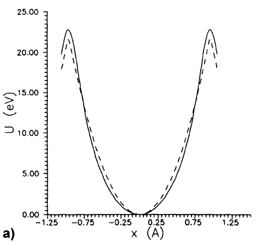
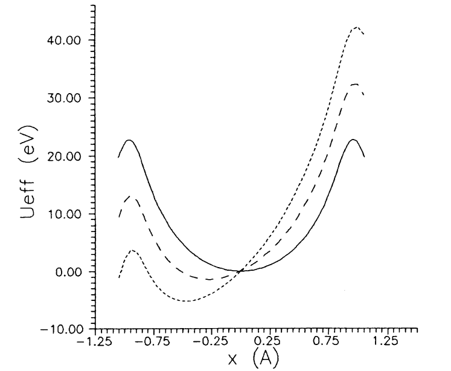
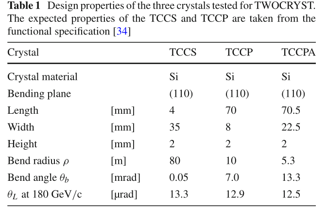
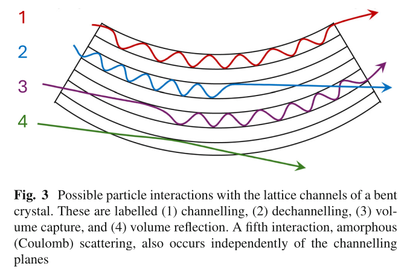
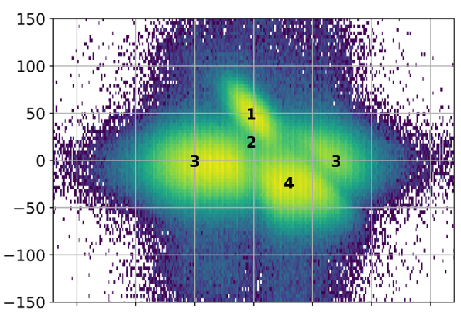

1. [book](#crystal-channeling-and-its-application-at-high-energy-accelerators)
2. [article May 2025](#performance-of-short-and-long-bent-crystals-for-the-twocryst-experiment-at-the-large-hadron-collider)
3. [article March 2026](#new-direction-for-bent-crystals)

## CRYSTAL CHANNELING AND ITS APPLICATION AT HIGH ENERGY ACCELERATORS
*by Biryukov, Chesnokov, Kotov*

### CHAPTER 1: Channeling of High-Energy Particles in Crystals

- **1.1 Structure of crystals:**  
Crystals are characterized by a highly ordered, periodic arrangement of atoms in a lattice $(r=n_1\cdot a + n_2\cdot b + n_3\cdot c)$. These atoms form distinct planes and axes (strings). The physical orientation of these planes, described by Miller indices $(h,k,l)$, determines the pathways available for high-energy particles to travel through the crystal.  

- **1.2 Electric fields in crystals**
In disaligned crystals, a variety of processes take place in the collision events, such as angular scattering in multiple collisions with the atomic nuvlei, and energy loss in collisions with atomic electrons. But actually, the atomic order in crystals is really important (1912).  
The theoretical explanation of the channeling effects has been given by
Lindhard, who has shown that when a charged particle has a small inci-
dent angle with respect to the crystallographic axis (or plane) the successive
collisions of the particle with the lattice atoms are correlated, and hence one
has to consider the interaction of the charged particle with the atomic string
(plane).  
When a high-energy particle grazes the atomic planes at a very shallow angle, it interacts with the macroscopic electric field of the entire plane rather than individual nuclei. This leads to the "continuous potential approximation", where the discrete charges of atoms are averaged into continuous sheets of electrical charge, creating an electromagnetic potential barrier.  
_(see interplanar Moliere potential for the Si channel (110))_

- **1.3 Particle motion in the potential of atomic plates**
Positively charged particles entering the space between atomic planes with low transverse energy become trapped in the "potential well" (_axial channeling:_ particle is bound with atomic strings; _planar channeling:_ particle is bound with atomic planes). They are continuously repelled (never collides) by the positive nuclei on either side, causing them to oscillate transversely as they move forward. The maximum entry angle that allows for this trapping is known as the Lindhard critical angle.  
    * Condition for the capture of the particle into the channeling mode: $\frac{pv}{2}\theta^2 + U(x) \leq U_0$  
    * Limiting angle of capture: $\theta_L = \sqrt{2U_0/pv}$, so for Si 110 $\theta_L$ goes from 20 $\mu$ rad (100 GeV) to  7 $\mu$ rad (1 TeV)

- **1.4 Dechanneling**
Particles do not remain channeled indefinitely. Due to multiple scattering off the crystal's electrons and the thermal vibrations of the atomic nuclei (as well as from the crystal lattice defects), the transverse energy $E_T$ of a channeled particle gradually increases. Once this energy exceeds the height of the potential barrier, the particle escapes the channel. The average distance traveled before this occurs is the "dechanneling length" $L_D=4E_C/j_{0,1}^2D_0$.

- **1.5 Energy loss**
Energetic charged particles in solids lose energy mostly in electronic collisions. In a disaligned crystal, the energy lost by a relativistic particle shows the weIl-known Landau distribution. Instead, when a beam is aligned with respect to the atomic planes, the particle distribution over the transverse coordinate $x$ undergoes an important change, resulting in the beam being split into the channeled and random fractions. This change affects the energy-loss spectrum of the beam partides in the aligned crystals.  
Because channeled particles are largely confined in a region with an electronic density much lower than the averaged, the contribution from the close scattering is suppressed (they avoid the dense electron clouds surrounding the nuclei). As a result, they suffer significantly less ionization energy loss compared to unchanneled particles passing through the same material.

- **1.6 Axial channeling**
While planar channeling confines particles in one dimension (between two planes), axial channeling confines them in two dimensions (trapped when $E_T$ less than the critical value). A particle travels roughly parallel to a specific string of atoms (an axis) and spirals around it, guided by the two-dimensional continuous potential of the atomic string.

### CHAPTER 2: Deflection of High-Energy Particles by a Bent Crystal

- **2.1 Particle motion in a bent channel**
When a crystal is mechanically bent, the channeled particles follow the curvature. In the particle's frame of reference, this introduces a centrifugal force. This force effectively "tilts" the potential well, lowering the potential barrier on the outer side of the curve (in physics terms, bending the crystal adds a linear centrifugal potential to our electrical potential well, this effectively "tilts" the well. The outer wall becomes shallower, and the resting point of the particle shifts outward.). If the bending radius is smaller than a critical value (the Tsyganov radius), the well disappears entirely, and channeling becomes impossible.

- **2.2 Deflection efficiency**
The overall efficiency of bending a beam depends on how many particles can initially enter the channel and how many survive the bend (not having bending dechanelling or scattering in the bent crystal). Infact, efficiency is strictly limited by "bending dechanneling", the immediate loss of particles whose transverse energy exceeds the lowered outer barrier of the tilted potential well.

### CHAPTER 3: Experimental Investigations of Channeling

- **3.1 Introduction**
This section bridges theoretical physics with early experimental efforts at laboratories like Dubna, IHEP, CERN, and Fermilab, introducing the first practical demonstrations of steering high-energy particle beams using bent crystals.

- **3.2 Crystals and Bending Devices**
Successful channeling requires nearly perfect crystals, almost exclusively silicon or germanium, prepared with precise cutting and chemical etching to remove surface defects. To bend the crystals uniformly without breaking them, specialized mechanical devices like three-point or four-point (U-shaped) benders are used to apply highly controlled stress.

- **3.3 General Experimental Methods**
A typical experimental setup involves positioning the crystal in the beamline using high-precision goniometers to align the crystal planes with the incoming beam. Downstream tracking detectors, such as drift chambers or silicon micro-strip detectors, are used to measure the exact trajectory of the deflected particles.

- **3.4 Deflection Efficiency Measurements**
This subchapter covers the empirical data gathered to quantify how well the crystals steer beams. It discusses how the measured deflection efficiency heavily depends on the beam's angular divergence, the particle energy, and the crystal's bending angle, confirming theoretical predictions.

- **3.5 Energy Loss in Bent Crystals**
Experiments investigating the energy spectrum of the deflected beam confirm that particles successfully channeled through a bent crystal continue to exhibit anomalously low ionization energy loss, proving they remain trapped between the atomic planes throughout the entire curve.

- **3.6 Dechanneling Investigation**
Experimental measurements specifically targeting the survival rate of particles as a function of crystal length. The data confirms the theoretical model that the dechanneling length is directly proportional to the momentum of the traversing particle.

- **3.7 Dynamic Equilibrium**
This section describes the complex steady-state beam dynamics inside a long bent crystal, where a balance is established between the continuous flux of particles scattering out of the channel (dechanneling) and particles scattering into the channel from the bulk material.

- **3.8 Volume Capture**
Experimental proof is presented for "volume capture"—a phenomenon where an initially unchanneled particle scatters off nuclei deep inside the curved crystal, loses transverse energy, and suddenly falls into the tilted potential well, becoming channeled for the rest of the bend.

- **3.9 Influence of Crystal Lattice Imperfections on Beam Deflection**
Experimental data demonstrating how detrimental physical defects are to channeling. Dislocations, impurities, and uneven bending stresses create localized distortions in the potential well, causing immediate dechanneling and a sharp drop in overall beam deflection efficiency.

- **3.10 Topics Under Development**
A look at the forward-thinking applications and experiments active at the time of the book's writing, such as utilizing bent crystals to extract beams directly from the circular orbits of synchrotrons, splitting beams, and investigating the focusing properties of shaped crystals.

## Performance of short and long bent crystals for the TWOCRYST experiment at the Large Hadron Collider
*in European Physics Journal*

_This paper reports the results of the validation of three bent silicon crystals (one for splitting and two for precession) supplied by INFN-Ferrara for TWOCRYST, using a 180 GeV beam (30% $\pi^+$, 70% protons)._  

Although the bend angle remains constant across different momenta (i.e., the phenomenon is non-dispersive), the channelling acceptance and efficiency still depend on the particle momentum. Crystals with lengths in the range of 5 to 10 cm, bent to angles between 5 and 15 mrad, are under consideration for measurements of the electric and magnetic dipole moments of short-lived charmed baryons, such as the $\Lambda^+_c$ (The resulting spin rotation within the crystal’s strong effective electromagnetic fields enables measurements of the baryons’ electric and magnetic dipole moments).  
Such large deflection angles over short distances cannot be achieved using conventional magnets. TWOCRYST has been installed in the LHC to carry out beam tests in the TeV energy range.  

**Channeling:** when a charged particle has a small incident angle $\theta_{in}$ relative to the crystallographic planes or axes, it experiences the effect of a continuous potential that traps the particle between the planes (planar and axial channeling, respectively).  
($\theta_{in}\leq \theta_L=\sqrt{2U_0/p\beta c}$ where $U_0$ potential well depth)

(5) amorphus scattering: between an incoming particle and a lattice atom  
(2) dechanneling: when an initially channeled particle escapes the potential well before reaching the end of the crystal, predominantly caused by multiple scattering with the atomic nuclei   
(3) volume capture: allows a particle initially outside the channeling condition to enter channeling, by losing energy through scattering   
(4) volume reflection: can occur when a particle approaches the crystal bending plane close to the tangent, casuing particles to be reflected in a direction opposite to the bending direction of the crystal

When the crystal is bended, the effective potential-well depth decreases with increased bending per unit length, scaling with a factor $(1-\rho_{crit}/\rho)^2$ where $\rho$ is the bending radius; so the critical angle becomes $\theta_L=(1-\rho_{crit}/\rho)\sqrt{2U_0/E}$

What they measured: channeling efficiency $\epsilon_{ch}=N_{ch}/N_{tot} \times 100$  

**Experimental setup:**
- TCCS (Target Collimator Crystal for Splitting): A short (4 mm) crystal with a small bend angle (50 $\mu$ rad). It is bent using a U-shaped metallic holder, a well-established technique used for LHC beam collimation. Its purpose is to split protons from the main LHC beam halo.
- TCCP (Target Collimator Crystal for Precession): A significantly longer (70 mm) crystal with a much larger bend angle (6.9 mrad). Like the TCCS, it uses a mechanically clamped metallic holder. Its purpose is to channel and induce spin precession in the charmed baryons.
- TCCPA (Target Collimator Crystal for Precession - Anodic): A novel crystal of similar length (70.5 mm) but bent to an even larger angle (13.3 mrad). Instead of mechanical clamping, it is bent using an anodic bonding technique, where the silicon wafer is permanently bonded to a curved glass substrate using high voltage and temperature. This method was hypothesized to provide more uniform bending.

**Analysis:**  
1. the reference data, collected without interactions with the crystal, are used to find the relative positions of the tracking detectors, the alignment parameters are determined via the minimisation of a $\chi^2$ calculated using the tracks of the alignment dataset.
2. the data recorded with crystals in amorphous orientation are used to find the edge of each crystal in the deflection plane $x$, and also verifies the measured width of each crystal.
3. the high statistics channelling data, collected with the crystal in the channelling orientation, are used to determine the channelling efficiency for the three crystals: $N_{tot}$ only includes particles with the potential to be channeled, so with incoming angle within one Lindhard angle, $N_{ch}$ is identified from their deflection angle $\Delta\theta_x$.

(1) channeling: entered at almost 0 degrees, within the critical angle, they successfully entered the potential well and were and were steered by the full bend of the crystal, by 50 $\mu$ rad  
(2) dechanneling: entered almost 0 but escaped the potential well, but they might still receive a partial bend, that's why they smear vertically down the $y$ axis between the full bend and the zero  
(3) amorphous scattering: entered too steeply and just crashed through the silicon as it it were a normal block of material, they exit with zero deflection  
(4) volume reflection: hit the curved planes from outside and bounced it off, negative deflection  
(5) volume capture??

## New direction for bent crystals
*in Cern Courier*

1963) crystal channeling predicted in simulations and experimentally confirmed  
1965. theoretical foundations  
1976) bent crystals for beam control  
1992. first xperimental demonstration of the effect by measuring the magnetic moment of the $\Sigma^+$, using a bent silicon crystals to induce spinh precession (substituting massive conventional magnets)  

1993. SPS @ CERN
2023) crystal collimation part of LHC

new frontiers:
- using bent crystals in the LHC not just to steer beams, but also to probe the spin of short-lived particles
- 

The TWOCRYST collaboration is exploring whether the technique can be extended to study the spin of short-lived charm baryons.  
The lightest charm baryon, the $Λ_c^+c$ (udc), has an extremely short lifetime of roughly 200 femtoseconds. Even at 1 TeV, it only travels a few centimetres before decaying. The magnetic fields needed to study its spin precession cannot be provided by conventional magnets, but are well within reach if bent crystals are used. If produced at a fixed target, a clean sample of its decays to a proton, a kaon and a pion can be obtained via tracking and invariant-mass reconstruction, with decay angles yielding spin information.

_why?_  
Unique opportunity to explore QCD at the interface between heavy and light quarks. Measurements of its spin precession would also provide exceptional sensitivity to a possible electric dipole moment – a potential signature of physics beyond the Standard Model.

_why measuring spin precession is important?_  
Measurements of spin precession have long played a central role in particle physics, providing deep insights into fundamental interactions and symmetries. The anomalous magnetic moments of the proton and neutron – measured in the 1930s and 1940s – remained unexplained for decades until the emergence of the quark model in the 1960s. While conventional magnet-based techniques remain highly effective for relatively long-lived particles such as the muon, particles as short-lived as charm baryons have so far remained experimentally inaccessible. The results from TWOCRYST suggest that bent crystals may allow the first direct experimental probe of electromagnetic dipole moments in charm baryons, opening a new window on QCD dynamics and offering a sensitive test for physics beyond the Standard Model.

