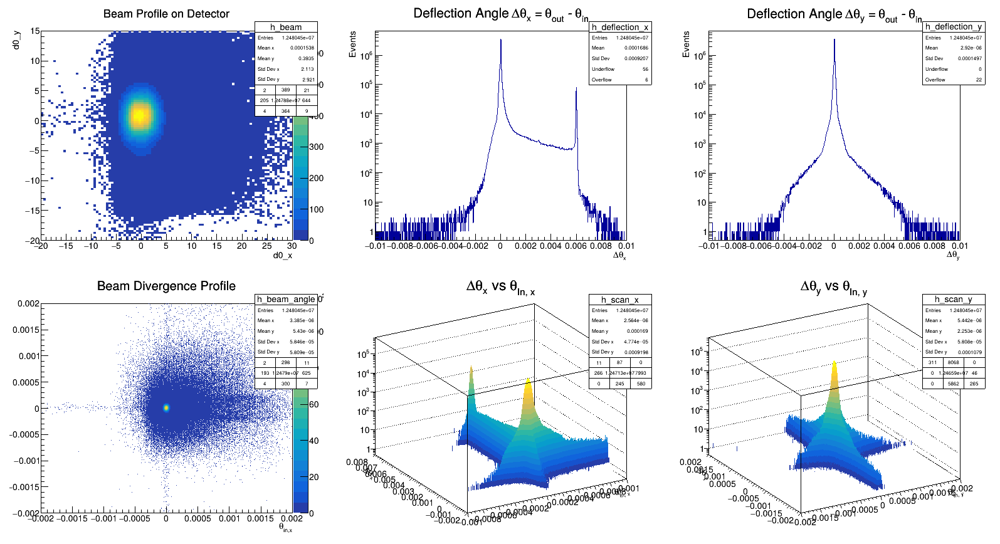
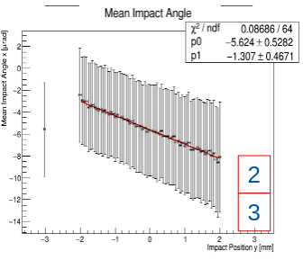
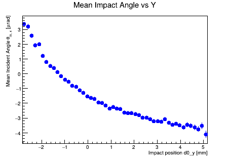
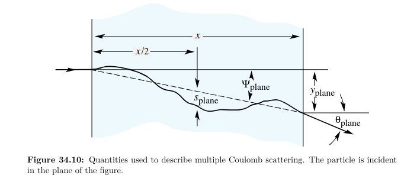

# Traineeship al CERN

1. [WEEK 1 (JUL 01)](#week-1)
    - [Access office computer](#access-office-computer)
    - [Some bibliography](#some-bibliography)
    - [Looking at data structure](#looking-at-data-structure)
2. [WEEK 2 (JUL 06)](#week-2)  
    - [Measuring the channeling efficiency (steps to do)](#measure-the-channeling-efficiency)
3. [WEEK 3 (JUL 13)](#week-3)
    - [Measuring the torsion correction](#measure-the-torsion-correction)
4. [WEEK 4 (JUL 20)](#week-4)
    - [Calibrate the detectors and alignment check](#calibrate-the-detectors-and-alignment-check)
    - [Crystal edges](#crystal-edges-found-for-each-run)
    - [Mapping the torsion](#mapping-the-torsion)
    - [Studying the experimental setup](#studying-the-experimental-setup)
5. [WEEK 5 (JUL 27)](#week-5)
    - [Miscellaneous](#to-do)
    - [Multiple Coulomb Scattering](#multiple-coulomb-scattering)
    - [Measuring multiple coulomb scattering](#measuring-multiple-coulomb-scattering)
    - [Find the crystal edges: scattering method](#find-the-crystal-edges-scattering-method)
6. [WEEK 6 (AUG 10)](#week-6)
    - [Taking into account d and theta errors](#taking-into-account-d-and-theta-errors)
    - [Computing efficiency errors](#computing-efficiency-errors)
    - [Systematics](#systematics)
    - [PDG on errors](#pdg-on-errors)
7. [WEEK 7 (AUG 17)](#week-7)
    - [Simulation](#simulation)
8. [WEEK 8 (AUG 24)](#week-8)
    - [Finish week 6 work](#finish-week-6-work)

## WEEK 1  

### Access office computer
```
ssh amoro@lxplus.cern.ch
```
```
ssh amoro@pcbe16774
```

### Some bibliography
(more in [bibliography.md](../aboutcrystals/bibliography.md))
- [_Crystal channeling and its application at high-energy accelerators_](./aboutcrystals/crystal%20channelling.pdf)  by Biryukov, Chesnokov, Kotov
- [_Performance of short and long bent crystals for the TWOCRYST experiment at the Large Hadron Collider_](./aboutcrystals/s10052-025-15092-y.pdf) in The European Physics Journal (May 2025)
- [_New direction for bent crystals_](./aboutcrystals/New%20directions%20for%20bent%20crystals%20–%20CERN%20Courier.pdf) in Cern Courier by P. Hermes, S. Redaelli (March 2026)  

$\to$ summary of these in [books.md](../aboutcrystals/books.md)

### Looking at data structure
data to look at:  
[recoDataSimple_8430_xtalMerging.root](https://cernbox.cern.ch/files/spaces/eos/user/p/pahermes/018_crystals/260701_Anna_Background_Infos/recoDataSimple_8430_xtalMerging.root):
- 1 tree (`simpleEvent`)  
- 9 branches  
    - `Time`
    - `Date`
    - `Event` (run/I, evtnum/I, nuclear/I, nuclearRaw/I)
    - `GonioPos` (x/D, y/D, z/D)
    - `MultiHits` (p_nHits[6]/I, thetaIn_x/D, thetaIn_y/D, thetaInErr_x/D, thetaInErr_y/D, d0_x/D, d0_y/D, d0Err_x/D, d0Err_y/D)
    - `Tracks` (thetaIn_x/D, thetaIn_y/D, thetaOut_x/D, thetaOut_y/D, thetaInErr_x/D, thetaInErr_y/D, thetaOutErr_x/D, thetaOutErr_y/D, d0_x/D, d0_y/D, d0Err_x/D, d0Err_y/D, d0Out_x/D, d0Out_y/D, d0OutErr_x/D, d0OutErr_y/D, chi2_x/D, chi2_y/D, chi2Out_x/D, chi2Out_y/D)
    - `MultiTracks` (d0In1_x/D, d0Out1_x/D, d0In2_x/D, d0Out2_x/D, d0In3_x/D, d0Out3_x/D, thetaIn1_x/D, thetaOut1_x/D, thetaIn2_x/D, thetaOut2_x/D, thetaIn3_x/D, thetaOut3_x/D, d0In1_y/D, d0Out1_y/D, d0In2_y/D, d0Out2_y/D, d0In3_y/D, d0Out3_y/D, thetaIn1_y/D, thetaOut1_y/D, thetaIn2_y/D, thetaOut2_y/D, thetaIn3_y/D, thetaOut3_y/D)
    - `SingleTrack` (singleTrackEvent/I)
    - `MultiHit` event (multiHitEvent/I)
- time and date are `Char_t` so characters $\to$ to see them write on root terminal `root[1] simpleEvent->Scan("Time:Date")`
- some leaves are `TLeafI` so integers, others `TLeafD` so double

$\to$ code to open them [open.py](../recoDataSimple/open.py) or [open_as_df.py](../recoDataSimple/open_as_df.py)

or from root terminal:
```
root -l file.root

root [0] TFile file0 = TFile::Open(file.root)
root [1] file0->ls()
root [2] name_tree->GetListOfLeaves()->Print()
root [3] name_tree->Print()
root [4] new TTreeViewer(name_tree)
root [5] name_tree->Draw("name_variable")
```
or also the command:
```
root [0] new TBrowser
```


## WEEK 2

informations extracted from the runs:
| long crystal 1 | data   | time   | long crystal 2 | data   | time   |
|----------------|--------|--------|----------------|--------|--------|
| 8430           | 151024 | 184745 | 8655           | 281024 | 012716 |
| 8431           | 151024 | 201923 | 8656           | 281024 | 021740 |
| 8430 & 8431    | 151024 |        |                |        |        |
| 8650           | 271024 | 181615 |                |        |        |

what type of data analysis can i do?  
- isolate clean events (`singleTrackEvent == 1`) which prevent from considering events from "pile-up effect", and check $\chi^2$ (`chi2_x`, `chi2_y`)
- beam divergence profile: how is the beam arriving to the detector: `thetaIn_y` vs `thetaIn_x`, `d0_y` vs `d0_x` (?)
- $\Delta\theta_x=\theta_{out}-\theta_{in}$ of `singleTrackEvent` (where are the peaks? i expect 0 and some $\mu$ rad)
- crystal acceptance $\Delta\theta_x$ vs $\theta_{in,x}$  

from [checkdata2.py](../recoDataSimple/checkdata2.py):


what to do next:
- ✅ check through [checkdata1.py](../recoDataSimple/checkdata1.py) that within the same run the position of the goniometer ($x,y,z$) does not change
- ✅ check about `SingleTrack`, `MultiHit`: they are either 0 or 1 and they always match in every run
- ✅ look at the angle values from the [articles](./aboutcrystals/s10052-025-15092-y.pdf) vs mine  
    | | | TCCP | TCCPA | new long crystals |
    |-|-|-----|-------|-------|
    |length|[mm]|70|70.5|74|
    |width|[mm]|8|22.5|12.8|
    |height|[mm]|2|2|2|
    |bend radius $\rho$ | [m]|10|5.3|12|
    |bend angle $\theta_b$ | [mrad]|7.0|13.3|6.0|
    |$\theta_L$ @ 180 GeV/c | [$\mu$ rad]|12.9|12.5|12.99|  
$\theta_L = (1-\frac{\rho_c}{\rho})\sqrt{\frac{2U_0}{E}}$ where: $\rho_c=\frac{E}{U'(x_c)}$, $U'(x_c)=5.7$ GeV/cm, $U_0=16$ eV for Silicon (110) 

### Measure the channeling efficiency $\epsilon_{ch}=\frac{N_{ch}}{N_{tot}}\cdot 100$

- center the angle and choosing $\theta_0$ for torsion correction $\tau_y$, which is the variation of the crystalline plane orientation along the direction ($y$) perpendicular to the bending plane ($x$), and must be accounted for (the different orientations of the crystallographic planes along the crystal front surface influence the angular range in which particles can be channelled, i.e., the cut at $\pm 1/2 \,\theta_L$ may not be centred on zero, but a correction parameter $\theta_0 = \theta_0 (y)$)
    - ✅ in [compute_edges1.py](../recoDataSimple/compute_edges1.py) we treat the crystal as if it was ideal, and we find a single global $\theta_{optimal}$ from the peak of the angular scan: we find the function of $\theta_0(x)$ and find the peak - the one that maximize the efficiency.
    - ❌ what the articles does is that it takes the beam “spot” (`d0_x` vs `d0_y`) and divides it into a checkerboard grid. For each square on the grid, it performs an angular scan (like my previous h_scan) and finds the specific peak angle $\theta_0$ for that square. It then reapplies a correction to each particle by subtracting the local $\theta_0$
- $N_{tot}:$ filter the data set, choosing the events that produced a single track, have a good $\chi^2$ value (?), have actually entered the crystal, and have an angle within $\pm\frac{1}{2}\theta_L$ (actually we choose them $|\theta_{in,x}-\theta_0|\leq\frac{1}{2}\theta_L$):
    - to filter spatially those who entered the crystal (of dimension width $\times$ length), i look at `d0` variables $x$ and $y$ (`d0` and `d0Out`), total and from those events that will present some channeling (so $\Delta\theta_x>\sim 5850 \mu$ rad, number found as $\mu-4\sigma$ by preliminary fit) and from these last ones filtered `d0Out`, which form an almost perfect rectangular, i infere the position of the crystal with respect to the beam through a sliding window method (which maximize the integral).
    - to filter the particles that have entered with the right angle, we first need to find $\theta_0$ in order to apply the filter $|\theta_{in,x}-\theta_0|\leq\frac{1}{2}\theta_L$:
- identify $N_{ch}$: on the $\Delta\theta_x$ filtered histogram perform a gaussian fit on the channeling peak, only from the right side of the peak, then do the integral around the peak
- compute $\epsilon_{ch}=\frac{N_{ch}}{N_{tot}}\cdot 100$ amd its error - we choose a binomial distribution

$\to$ [slides week 2](./slides/week2.pdf)

([UP](#traineeship-al-cern))

## WEEK 3

**TO DO:**
- ❌ improve $\Delta x$ spatial shift: if $\Delta z$ is the distance between the two detectors, the shift should be $\Delta x=\Delta z \cdot\tan(\theta_{defl})\sim\Delta z\cdot\theta_{defl}$
- ❌ remove bkg?:
    - removing instrumental noise, volume reflection, multiple scattering bkg from $N_{tot}$(?) by using the particles that didn't hit the crystal as gauge, plot their $\Delta\theta$ distribution, normalize it and subtract it (so that its height matches the zero-peak of my data) from my actual data
    - removing dechanneling bkg (gradually decreasing) from $N_{ch}$: can be modelled by a Crystal Ball function (power law tail) and subtracted it from the $N_{ch}$ integral  
    $\to$ the article says that since the two peaks are very well separated, the dechanneled background is negligible, because it is spread over a much broader angular range
- ❌ find a systematical uncertainty in $\epsilon_{ch}$ and in $N_{ch}$
- ✅ analyse all the datasets

### Measure the torsion correction✅
Checkerboard grid search (1 mm $\times$ 1 mm) of torsion correction (see [week 2 analysis](#measure-the-channeling-efficiency)) $\to$ [compute_channeling.py](../recoDataSimple/compute_channeling.py):  
- for every small square (the $xy$ beam distribution is divided into) we find at which $\theta_{x,in}$ the efficiency from the cut $\frac{1}{2}\theta_L$ is maximized
- do a 2D torsion map ($x$, $y$, and angle shift). these values are then fitted ussing a function along $x$ and $y$ in the entire crystal surface to extract the continuous distribution of the map ($z=p_0+p_1 x + p_2 y + p_3 y^2$ where $p_0$ is $\theta_{baseline}$, $p_1$ is $\tau_x$, and $p_2$ is $\tau_y$). we will obtain an average value for the torsion on the $y$ direction, while the torsion along the $x$ direction is negligible ($\tau_x\sim 0$).  
- cut will be $|\theta_{in,x}-(\theta_{0,center}+\tau_y\cdot d0_y)|\leq\frac{1}{2}\theta_L$ (this means that you are accepting only those particles whose entry angle ($\theta_{in}$) is at most half the Lindhard angle ($0.5 \cdot \theta_L$) away from the optimal local angle of the crystal plane at that height $y$ (which is calculated as $\theta_{off} + \tau_y \cdot y$). This is the most elegant and correct way to apply the cut, taking into account both the goniometer offset ($\theta_{off}$) and the twist ($\tau_y$) simultaneously.)  
- computing the final $\epsilon_{ch}$, after applying an angular shift to the incoming direction of the particles, accordingly to the value of the torsion map at their impact position on the crystal surface  
    $\to$ we obtain a global efficiency curve


- plotting $\theta_0$ vs $y$, we should see a *linear correlation*, and thus find $\tau_y$ [$\mu$ rad/mm]:   
(i was expecting (left image) but i obtain (right image))  
 

$\to$ [slides week 3](./slides/week3.pdf)

([UP](#traineeship-al-cern))

## WEEK 4

### Calibrate the detectors and alignment check
Calibrate the detectors with [check_alignment_detectors.py](../recoDataSimple/check_alignment_detectors.py):  
    1) compute histograms in $x$ and $y$ showing $d0_{out} - d0_{in}$: if the offset is smaller than $\sim 1–2\,\sigma$ of its own fit error, treat it as statistically consistent with zero;  
    2) fit linearly $d0_{in}$ vs $d0_{out}$, which slope should be $\sim 1$, in this way we also know there is no rotation and no scale mismatch between the two detectors planes (confirmation of alignment);  
    3) also check fit quality skewness (asymmetry of a data distribution around its mean) to ensure no asymmetric tail or contaminating subpopulation.  

Results:  
|  | **x** |  |  |  |  |  | **y** |  |  |  |  |  |
|---|---|---|---|---|---|---|---|---|---|---|---|---|
|  | **offset** | **sigma** | **X2/ndf** | **skewness** | **slope** | **intercept** | **offset** | **sigma** | **X2/ndf** | **skewness** | **slope** | **intercept** |
| **8430** | 0.0028 +/- 0.0001 mm | 0.0911 mm | 1.521 | -0.0074 | 0.9954 | 0.0065 mm | 0.0046 +/- 0.0001 mm | 0.0915 mm | 1.527 | -0.0058 | 0.9987 | 0.0056 mm |
| **8431** | 0.0021 +/- 0.0001 mm | 0.0912 mm | 1.548 | -0.0014 | 0.9957 | 0.0051 mm | -0.0049 +/- 0.0001 mm | 0.0918 mm | 1.574 | 0.0160 | 0.9988 | -0.0043 mm |
| **8650** | 0.0092 +/- 0.0001 mm | 0.0989 mm | 1.145 | -0.0173 | 0.9966 | 0.0102 mm | 0.0040 +/- 0.0001 mm | 0.0997 mm | 1.172 | -0.0110 | 0.9989 | 0.0044 mm |
| **8655** | 0.0109 +/- 0.0001 mm | 0.0987 mm | 1.335 | -0.0202 | 0.9965 | 0.0111 mm | 0.0148 +/- 0.0001 mm | 0.0993 mm | 1.422 | -0.0403 | 0.9985 | 0.0151 mm |
| **8656** | 0.0080 +/- 0.0001 mm | 0.0988 mm | 1.348 | -0.0132 | 0.9965 | 0.0078 mm | 0.0109 +/- 0.0001 mm | 0.0996 mm | 1.368 | -0.0296 | 0.9987 | 0.0110 mm |

### Crystal edges found for each run  

Knowing that the detectors are aligned, the shift we see has only physics reasons.  
We can compute precisely the $x$ shift for channeled particles:  
- curvature radius $R=\frac{L}{\theta}\sim 12$ m  
- the lateral displacement at the end of an arc is $\Delta x = R (1 - \cos\theta)$
- considering $\cos\theta=1-\theta^2/2$ (small angles)
- we obtain $\Delta x = \frac{L\cdot\theta}{2}$

| **run** | **$x_{min}$** |**$x_{max}$**|**$y_{min}$** |**$y_{max}$** |
|-|-|-|-|-|
|**8430**|[-1.1044 ± 0.1055 mm | 0.8965 ± 0.0933 mm]|[-5.0250 ± 0.1055 mm | 7.7750 ± 0.0933 mm]|
|**8431**|[-1.1044 ± 0.1055 mm | 0.8956 ± 0.0933 mm]|[-5.1000 ± 0.1055 mm | 7.7000 ± 0.0933 mm]|
|**8650**|[-0.2744 ± 0.1155 mm | 1.7256 ± 0.1117 mm]|[-5.7450 ± 0.1156 mm | 7.0550 ± 0.1117 mm]|
|**8655**|[0.5536 ± 0.1155 mm | 2.5536 ± 0.1117 mm]|[-6.9150 ± 0.1156 mm | 5.8850 ± 0.1117 mm]|
|**8656**|[0.5546 ± 0.1155 mm | 2.5546 ± 0.1117 mm]|[-6.8750 ± 0.1156 mm | 5.9250 ± 0.1117 mm]|

So also we can correct the Lindhard angle estimation:
$$\theta_L=\bigg(1-\frac{\rho_c}{\rho}\bigg)\sqrt{\frac{2U_0}{E}}$$
where:
- $\rho_c=\frac{E}{U'(x_c)}$ is the critical radius
- $E = p\beta c = 180\, \text{GeV}$ or $150\, \text{GeV}$
- $U'(x_c)=5.7\text{ GeV/cm}$ for the (110) plane in silicon
- $U_0=16\text{ eV}$ for silicon
- $\rho=\frac{L}{\theta_b}$

so for the $L=74\text{ mm}$ long crystals, with a $\theta_b=6\text{ mrad}$:  
$\big(1-\frac{180\cdot 10\cdot 6 \cdot 10^{-3}}{74\cdot5.7}\big)\sqrt{\frac{2\cdot 16}{180\cdot 10^9}}=12.992\,\mu\text{rad}$ or  
$\big(1-\frac{150\cdot 10\cdot 6 \cdot 10^{-3}}{74\cdot5.7}\big)\sqrt{\frac{2\cdot 16}{150\cdot 10^9}}=14.294\,\mu\text{rad}$


### Mapping the torsion
I choose a fit parabolic function (i want to use the simplest model that can accurately describe the data, but not so simple that it hides the actual physics):  
$\theta(x,y) = \theta_{baseline} + \tau_x \cdot x + \tau_y \cdot y + p_3\cdot y^2$  
- the `full_quadratic` function with 6 parameters can overfit the data and its noise, while a `pure_parabolic_y` is automatically imposing $\tau_x=0$ and it is too risky  
$\to$ first, i verify with the `full_quadratic` function that the curvature along $x$ is negligible, and then for the final fit i use the `parabolic_y` function to have a more robust fit  
- plot of how uniform is $\tau_y$ across $(x,y)$: plot the residuals from the fit  
- plot of how uniform is $\epsilon_{ch}$ across $(x,y)$  
- understand the meaning of the global efficiency curve plot: how aligned is the crystal after the torsion correction, the efficiency peak should be centered at zero. The curve is obtained from all the data, through a scan along $\theta_{in}$.

Final results:  
|_parabolic model_|     | $\tau_y$        | $\tau_x$         | $\epsilon_{ch}$                     | angle               | sigma             | events discarded |
|---|-------------------|-----------------|------------------|-------------------------------------|---------------------|-------------------|------------------|
| 1 | 8430              | 6.25(4) urad/mm | -0.28(4) urad/mm | (19.6 ± 0.1 [stat] ± 0.0 [syst])%   | (6008.4 ± 0.2) urad | (21.0 ± 0.2) urad | 98%              |
| 1 | 8431              | 5.71(4) urad/mm |  0.28(4) urad/mm | (19.1 ± 0.1 [stat] ± 0.0 [syst])%   | (6008.4 ± 0.2) urad | (20.4 ± 0.2) urad | 98%              |
| 1 | 8430 & 8431       | 7.35(3) urad/mm | -0.70(4) urad/mm | (19.6 ± 0.0 [stat] ± 0.0 [syst])%   | (6008.2 ± 0.1) urad | (21.0 ± 0.1) urad | 98%              |
| 1 | 8650              | 3.89(1) urad/mm | -0.19(4) urad/mm | (17.1 ± 0.1 [stat] ± 0.0 [syst])%   | (6081.7 ± 0.1) urad | (26.0 ± 0.2) urad | 96%              |
| 2 | 8655              | 3.67(2) urad/mm |  0.83(5) urad/mm | (18.0 ± 0.1 [stat] ± 0.0 [syst])%   | (6122.6 ± 0.3) urad | (32.2 ± 0.2) urad | 97%              |
| 2 | 8656              | 3.80(1) urad/mm |  0.87(4) urad/mm | (18.0 ± 0.1 [stat] ± 0.0 [syst])%   | (6122.0 ± 0.3) urad | (32.4 ± 0.2) urad | 97%              |

### Studying the experimental setup

From [Luigi email:](https://outlook.cloud.microsoft/mail/inbox/id/AAQkADk0YWZmMDQ5LWFjYmQtNGI2OS04MzQzLWQ2OWEzNTMyNGM4ZQAQAKQ6%2BkI76qtAjeLpXOun5po%3D)  
- the distances of the planes relative to the crystal are: [-12434.0, -10356.0, 487.0, 4714.0, ~~11004.0~~, ~~19533.0~~];
- for the long crystals only the first four planes were used: two for the incoming track and two for the outgoing tracks;
- the crystals are 74 mm long.  

$\to$ [slides week 4](./slides/week4.pdf)

([UP](#traineeship-al-cern))

## WEEK 5

### to do:

- ✅ correct edges since $\text{width}=12.8\text{ mm}$:
    - correct how i do find edges along $y$ (they are statistically identical since $\Delta y < \sigma_\mu$, compatibility of 0.3): doing also here a sliding window that mazimize the integral
    - redo `compute_edges1.py` for each run to find edges (take advantage to also improve precision from 0.01 mm to 0.001 mm along $x$ and 0.01 mm along $y$)
    - redo plots about spatial cut
    - redo detectors alignment check by changing new edges and report here new results (a mean of $\sim 0.0029 \pm 0.0001$ it is not compatible with zero but is considered negligible compared to the width of the gaussian distribution, but the interpretation changes if the resolution is similar as the sigma of the gaussian)
    - correct margins in `compute_channeling.py`

- ✅ do not consider the edges in the analysis (cannot measure a local torsion angle where there's no beam so only considering the beam-illuminated window):
    - need a different consideration for edges for `filter2_spatial_cut` and for the fit: crop to where the data lives
    - torsion-map grid range: i can consider along y the area $\mu\pm 3 \sigma$ from the beam or the quantiles (does not assume gaussian tails), should be a separate, narrower range that tracks where the beam actually has statistics
    - if i restrict also the window for the spatial cut i am losing statistics, but i am also considering the data (maybe not from the fit but) still for the efficiency calculation

- ✅ explore 8650:  
    $\to$ compared in [compare_histo.py](../recoDataSimple/compare_histo.py)
    - Luigi and Melanie said there were some problems during the data taking and with one magnet: at energy 150GeV/c and by beamline hardware constraint also the current was lowered (otherwise particles would not follow the intended trajectory)
    - wider critical angle
    - channeling peak sigma is wider, as lower momentum particles get kicked around more (more multiple coulomb scattering, as mcs scales as $1/p$)
    - lower efficiency, as dechanneling probability increases at lower energy (trajectory more easily perturbed out of the channel)
    - why channeling peak shifted by $~70\,\mu\text{rad}$? the tracker calibration itself is not the source of the anomaly (see [offset results](#calibrate-the-detectors-and-alignment-check))

- ✅ look into the spikes: select bins with spikes vs the ones that have not: 
    - the periodic spikes seen in the downstream impact position distribution of channeled particles are an instrumental artifact (purely geometric/instrumental), not a beam or crystal effect: each tracking plane measures a hit only to the precision of one readout strip, so the position from any single plane is quantized in steps of the strip pitch $p$. A track's slope is reconstructed from the difference between hits on two planes separated by baseline $L$, so the slope itself is quantized in steps of $p/L$. When this slope is extrapolated a distance $D$ back to the crystal exit (or any reference plane), the reconstructed position inherits a quantization step of order $Δx ≈ p × D / L$ (a short baseline $L$ amplifies this step, a long baseline suppresses it). In our setup, the upstream arm spans $≈10\text{ m}$ while the downstream arm spans only $≈0.5\text{ m}$: a factor of $~20$ difference in $L$. For a comparable extrapolation distance $D$, this means the downstream reconstructed position is quantized in steps roughly $20×$ coarser than upstream. That coarse grid becomes visible as periodic spikes in `d0Out_x`, while the upstream arm's much finer slope resolution keeps its position distribution effectively continuous.

- confidence level and similar stuffs
- look for each bin of efficiency mapping how different are the plots deltatheta vs theta for different efficiency
- ✅ understand MCS multiple coulomb scattering
- look into MCS: select one outcoming angle and and check the arrival one([check into pdg about mcs](https://pdg.lbl.gov/2023/reviews/rpp2023-rev-passage-particles-matter.pdf#section.34.3))
- draw a better experimental layout, ask Luigi about beam window and be sure were the vacuum pipes are

### Multiple Coulomb Scattering
  

The question we need to ask ourselves is: on average, how much will this particle be deflected at the end of its path? Most of the particles will be deviated of an angle near zero (center of the gaussian distribution).  
The width of this curve is the key value: it tells us how much, on average, the particle is deflected. This value is called the root-mean-square (RMS) angle (angolo quadratico medio) and is denoted by $\theta_0$, and can be computed through the Highland formula, which is derived by Rutherford scattering cross section formula.  
In the formula we have: $\theta_0\propto 1/p$, $\propto 1/\beta c$ (the higher the velocity and more massive the particle is, the less deviated it gets), and $\propto z$. Then we also have the material's characteristics: the width $x$ and the radiation length $X_0$ (depends on the 'density').  


$\to$ from [PDG: Passage of Particles Through Matter](https://pdg.lbl.gov/2023/reviews/rpp2023-rev-passage-particles-matter.pdf#section.34.3)

A charged particle traversing a medium is deflected by many small-angle scatters. Most of this deflection is due to Coulomb scattering from nuclei as described by the Rutherford cross section. (However, for hadronic projectiles, the strong interactions also contribute to multiple scattering.)  
For many small-angle scatters the net scattering and displacement distributions are Gaussian via the central limit theorem. Less frequent “hard” scatters produce non-Gaussian tails *(= particelle che prendono grandi spallate perche colpiscono nucleo in pieno)*. These Coulomb scattering distributions are well-represented by the theory of Molière (relativistic pions, kaons, and protons). If we define  

$\theta_0=\theta_{plane}^{rms}=\frac{1}{\sqrt{2}}\theta_{space}^{rms}$  

then it is sufficient for many applications to use a Gaussian approximation for the central 98% of the projected angular distribution, with an rms width given by Lynch & Dahl:  

$\theta_0=\frac{13.6\text{ MeV}}{\beta c p}z\sqrt{\frac{x}{X_0}}\big[1+0.088\log_{10}\big(\frac{x z^2}{X_0 \beta^2}\big)\big]$  
$=\frac{13.6\text{ MeV}}{\beta c p}z\sqrt{\frac{x}{X_0}}\big[1+0.038\ln\big(\frac{x z^2}{X_0 \beta^2}\big)\big]$  

Here $p$, $βc$, and $z$ are the momentum, speed, and charge number of the incident particle, and $x/X_0$ is the thickness of the scattering medium in radiation lengths. This takes into account the $p$ and $z$ dependence quite well at small $Z$, but for large $Z$ and small $x$ the $β$-dependence is not well represented. This equation describes scattering from a single material, while the usual problem involves the multiple scattering of a particle traversing many different layers and mixtures. Since it is from a fit to a Molière distribution, it is incorrect to add the individual $θ_0$ contributions in quadrature *(= non si puo' sommare e basta i contributi aria + silicio + rame ecc, ci sarebbe grave sottostima deviazione)*; the result is systematically too small. It is much more accurate to apply this equation once, after finding $x$ and $X_0$ for the combined scatterer.  

The nonprojected (space) and projected (plane) angular distributions are given approximately by  

$\frac{1}{2\pi\theta_0^2}\exp\big(-\frac{\theta^2_{space}}{2\theta_0^2}\big)d\Omega$  
$\frac{1}{\sqrt{2\pi}\theta_0}\exp\big(-\frac{\theta^2_{plane}}{2\theta_0^2}\big)d\theta_{plane}$  

where $θ$ is the deflection angle. In this approximation, $\theta^2_{space} ≈ (θ_{plane,x}^2 + θ_{plane,y}^2)$, where the $x$ and $y$ axes are orthogonal to the direction of motion, and $dΩ ≈ dθ_{plane,x} dθ_{plane,y}$. Deflections into $θ_{plane,x}$ and $θ_{plane,y}$ are independent and identically distributed. Fig. 34.10 shows these and other quantities sometimes used to describe multiple Coulomb scattering. They are  

$\psi^{rms}_{plane}=\frac{1}{\sqrt{3}}\theta_{plane}^{rms}=\frac{1}{\sqrt{3}}\theta_0$    
$y^{rms}_{plane}=\frac{1}{\sqrt{3}}x\theta_{plane}^{rms}=\frac{1}{\sqrt{3}}x\theta_0$  
$s^{rms}_{plane}=\frac{1}{4\sqrt{3}}x\theta_{plane}^{rms}=\frac{1}{4\sqrt{3}}x\theta_0$  

All the quantitative estimates in this section apply only in the limit of small $θ^{rms}_{plane}$ and in the absence of large-angle scatters. The random variables $s$, $ψ$, $y$, and $θ$ in a given plane are correlated. Obviously, $y ≈ xψ$. In addition, $y$ and $θ$ have the correlation coefficient $ρ_{yθ} = \sqrt{3}/2 ≈ 0.87$ *(1 would be perfect correlation)*.  

For Monte Carlo generation of a joint ($y_{plane}$, $θ_{plane}$) distribution, or for other calculations, it may be most convenient to work with independent Gaussian random variables ($z_1$, $z_2$) with mean zero and variance one, and then set  

$y_{plane}=z_1\, x\, \theta_0(1-\rho^2_{y\theta})^{1/2}/\sqrt{3}+z_2\,\rho_{y\theta}\, x\, \theta_0/\sqrt{3}=z_1\, x\, \theta_0/\sqrt{12}+z_2\, x\, \theta_0/2$  
$\theta_{plane}=z_2\,\theta_0$  

In this way the computer instantaneously gets an exit angle and a final position, which are correlated (no need of simulating all the small scatterings happening inside).  
Note that the second term for $y_{plane}$ equals $x\,θ_{plane}/2$ and represents the displacement that would have occurred had the deflection $θ_{plane}$ all occurred at the single point $x/2$.  

$\to$ **multiple coulomb scattering RMS of protons ($z=1$) for the $L=74\text{ mm}$ long silicon crystals ($X_0\sim9.37\text{ cm}$):**  
$\theta_0=66.5 \,\mu\text{rad}$

### Measuring multiple coulomb scattering
### Find the crystal edges: scattering method

$\to$ performed in [compute_edges2.py](../recoDataSimple/compute_edges2.py) (this method provides indipendence from channeling efficiency or torsion)

My current method ([compute_edges1.py](../recoDataSimple/compute_edges1.py)) to find the crystal edges is isolating the channeled particles, then use their impact position distribution to find where the population is the densest and call that the crystal footprint, but this only uses the channeled fraction, so ~20% of all the particles that actually crossed the crystal. what Luigi was suggesting instead is instead of relying on channeling at all, i can use the fact that every particle that physically traverses the crystal, picks up extra multiple coulomb scatterings that a particle passing beside the crystal does not.

- in small bins $(x,y)$ across the beam spot, compute the width (gaussian sigma or rms) of the outgoing angular distribution $\Delta\theta_x$ (or $\theta_{out}$) rather than its channeled peak position
- i am considering $\Delta\theta_x$ only on a range $\pm 150\,\mu\text{rad}$, in order to exclude channeling particles, while mcs is a purely statistic process and can be described by a gaussian curve around zero.
- map the local width as a function of impact position: outside the crystal, the width sits at the baseline, inside the crystal it should jump to $\theta_0\sim66.5\,\mu\text{rad}$ so the edges are were there should be a sharp, well-defined transition - that can be fitted through a step function  

1. in reality $\sigma_{measured}$ has also detector resolution contribution (usually measured through a run without target) (added in quadrature): $\sigma_{meas}=\sqrt{\sigma_{mcs}^2+\sigma_{track,in}^2+\sigma_{track,out}^2}$
2. why outside the crystal we don't get zero but $\sim12\,\mu\text{rad}$? even without the crystal, particles would still not travel with a perfect linear track, the beam has an intrinsic angular divergence (should be of $\sim12-15\,\mu\text{rad}$)

RESULTS:  
- i obtain a width in y of $\sim 8.4\text{ mm}$ instead of $12.8\text{ mm}$: re-try considering only one slide, but anyway could be because what we're getting it the *primary clean beam* (don't worry that for the torsion analysis we are not considering the edges anyway)
- along x i obtain exactly $\sim2\text{ mm}$
- along x outside the crystal i have $\sigma\sim12\,\mu\text{rad}$ which corresponds to the detector resolution, and inside the crystal i have   

|          | **$x$ [mm]**        | $x_{low}$  | $x_{high}$ | $\sigma_{x,bsl}$ [urad] | $\theta_{x,mcs}$ | **$y$ [mm]**        | $y_{low}$   | $y_{high}$ | $\sigma_{y,bsl}$ [urad] | $\theta_{y,mcs}$ |  
|----------|---------------------|------------|------------|-------------------------|------------------|---------------------|-------------|------------|-------------------------|------------------|  
| **8430** | **2.0796 ± 0.0004** | -1.0530(3) | 1.0266(2)  | 12.38 ± 0.00            | 67.05 ± 0.07     | **8.4470 ± 0.0026** | -2.5787(14) | 5.8683(22) | 69.78 ± 0.10            | -52.58 ± 0.10    |
| **8431** | **2.0789 ± 0.0004** | -1.0530(3) | 1.0259(3)  | 12.38 ± 0.00            | 67.08 ± 0.07     | **8.4528 ± 0.0028** | -2.5856(15) | 5.8672(23) | 68.87 ± 0.10            | -51.85 ± 0.11    |
| **8650** | **2.0703 ± 0.0007** | -0.2039(5) | 1.8664(4)  | 14.37 ± 0.01            | 85.21 ± 0.17     | **8.8781 ± 0.0028** | -3.6331(19)  | 5.2451(20) | 69.15 ± 0.14            | -50.81 ± 0.14    |
| **8655** | **2.1081 ± 0.0006** | 0.6081(5)  | 2.7162(4)  | 14.65 ± 0.01            | 72.79 ± 0.13     | **8.7125 ± 0.0065** | -4.9377(47) | 3.7748(44) | 63.78 ± 0.15            | -46.52 ± 0.15    |
| **8656** | **2.1093 ± 0.0006** | 0.6072(5)  | 2.7165(4)  | 14.66 ± 0.01            | 72.80 ± 0.12     | **8.6314 ± 0.0054** | -4.8957(40) | 3.7357(37) | 63.84 ± 0.13            | -46.52 ± 0.13    |


$\to$ [slides week 5](./slides/week5.pdf)

([UP](#traineeship-al-cern))


## WEEK 6

### Taking into account d and theta errors

- consider angle errors:
    - $\theta_{in,x}$ and $\theta_{in,y}$ are $\sim8.89\,\mu\text{rad}$ for 8430/8431 and $\sim9.67\,\mu\text{rad}$ for 8650/8655/8656
    - $\theta_{out,x}$ and $\theta_{out,y}$ are $\sim0\,\mu\text{rad}$
    - considering as it was an error and also downstream angle have that error? so $\Delta\theta$ gets an error of $\sim12.57\,\mu\text{rad}$ or $\sim13.67\,\mu\text{rad}$
    - no need of taking them into account in the edge finding

- consider `d0` errors:
    - $d_{in,x}$ and $d_{in,y}$ have $\sim0.105473\text{ mm}$ error for 8430/8431 and $\sim0.115547\text{ mm}$ for 8650/8655/8656
    - $d_{out,x}$ and $d_{out,y}$ have $\sim0.093297\text{ mm}$ error for 8430/8431 and $\sim0.111709\text{ mm}$ for 8650/8655/8656

in [`compute_edges1.py`](../recoDataSimple/compute_edges1.py):
- adding in quadrature: `d0` errors (tracker resolution on the coordinates) + uncertainty due to binning choice
- no error from fitting 

in [`compute_edges2.py`](../recoDataSimple/compute_edges2.py):
- resolution subtraction: since my mcs width is a convolution of physics and tracker resolution (the resolution adds in quadrature to a gaussian width, not linearly):
    - same order of 
- the transition parameter (4) is where d0 resolution shows up for edge finding - it's already fit from data but i can do a cross-check (if the fitted transition is noticeably larger than the mean resolution, that's telling that there's real edge roughness beyond pure detector blur):
    - fitted transition x is $\sim 0.092$ and resolution is $0.105$ so the edge is what we expect from the tracker resolution (good sign)
- systematic smearing: quantify how much my cuts are affected by finite d0 and theta resolution

in [`compute_channeling.py`](../recoDataSimple/compute_channeling.py):
- error on lindhard cut is computed doing a cut within $\theta_L/2\,\pm ...$ instead of just $\theta_L/2$ in order to compute an additional sys error for theta

### Computing efficiency errors

- torsion error (by the fit):
    - now every square bin has local $\theta_0\pm\sigma$ and local $\epsilon_{ch}\pm\sigma$
    - now `h2_torsion_map` carries real per-bin errors (from the local Gaussian fit above) instead of ROOT's default sqrt(content) fallback. This makes the fit below a proper inverse-variance-weighted chi2 fit: bins near the edges of the acceptance get a large local_theta_0_err and are automatically down-weighted, instead of contributing to the surface fit with the same weight as clean core bins.
    - `eff_err_stat` is the binomial (statistical) error on eff_ch, as before. We add a systematic term from the torsion-map baseline uncertainty theta_0_baseline_err: re-run the Lindhard cut + efficiency with theta_0 shifted by +/-1 sigma and take half the resulting spread in eff_ch. This is deliberately a re-evaluation rather than an analytic slope propagation, because the sensitivity of the acceptance is NOT uniform: it is large where the local efficiency amplitude is still near its ~25% core value, and vanishes towards the edges where the local efficiency amplitude drops to ~0%. Re-running the actual cut captures that shape automatically instead of assuming one fixed slope.

- efficiency error for single bins, and then combined (std dev which takes into account the spread between 15 to 25%):  
this would be wrong, because it would be before torsion correction and lindhard critical angle cut, and also the bins have different statistics, it is correct instead to recompute the efficiency over the full dataset  
    - we can treat `h2_eff_map` as validation to check spatial uniformity across the crystal surface, and if done after is to diagnose if the ploynomial is correct or is missing a term or if a region of the crystal is channeling differently (edges/miscuts)
    - also `plot_global_efficiency_curve` can be used as diagnostic: if the peak efficiency is centered at $\theta=0$ after correction, the torsion fit is correct (a mean of $\sim 0.56 \pm 0.02$ it is not compatible with zero but is considered negligible compared to the width of the gaussian distribution); it is checking that the correction surface correctly recenters the whole angular distribution

- the fit uncertainty on the gaussian fits gives <0.001%, probably due to the high statistics   
(i shifted mean and sigma by their fit error and tried to redo the efficiency computation, errors so small that nothing changes)

- also checked for time correlation via block splitting: divide the run in 10 blocks and redo the calculation of the efficiency, if ratio >1 there could be non homogeneous behaviour during the run  
RMS across blocks     = 0.238 %  
Mean binomial error   = 0.200 %  
Ratio (RMS/stat_err)  = 1.19  (consistent with binomial)  


### Systematics 

*the systematic errors are propagated on the final result, not on the intermediate fit parameters*

HOW:  
1) recompute `filter3_Lindhard_cut()` 
2) recompute `channeling_efficiency()` 
3) systematic error as mean between the two computed efficiencies $|\epsilon_{up}-\epsilon_{down}|/2$  
*And to find the total error:*  
4) add the errors in quadrature, assuming indipendence.Two of these are not obviously independent: the spatial-box shift changes which particles enter the torsion-map fit, which in turn slightly changes fit_params - but i am reusing the nominal fit_params for the box variation, which effectively assumes independence by construction. *"systematics treated as uncorrelated; box and torsion-map re-fit not jointly propagated."*

MAIN SOURCES:
- *fit model choice* - $\tau_x,\,\tau_y,\,c_y$ dependence:  
`parabolic_y` vs `full_quadratic` differ in $\tau_y$, rerun the whole efficiency chain and take the eff difference (one-sided difference)
- torsion map/grid bin choice - nx_slices, ny_slices dependence:  
rerun torsion_map with a coarser (nx_slices=5) or finer x-binning and check $\tau_x$ stability (if $\tau_x$ shifts by more than its statistical error, that's a systematic worth quoting)
- n sigma integration for $N_{ch}$ - bin min and bin max dependence:  
Varying that lower bound (e.g. $2.5σ$ vs $3.5σ$) and taking half the spread in efficiency is a clean shift-and-rerun systematic, and it's cheap since it doesn't require re-running the spatial/torsion/Lindhard chain — only the final channeling_efficiency integration step.
- preliminary channeling selection cut $\mu-3\sigma$:  
This threshold (preliminary_cut_on_deltatheta) determines who counts as "channeled" for computing the torsion map and spatial box in the first place — it's used upstream of everything. Varying it (e.g. $μ − 2.5σ$ vs $μ − 3.5σ$) and checking how much $τ_x$, $τ_y$, and the final edges shift would test whether your whole downstream chain is sensitive to this somewhat arbitrary choice.
- crystal dimension box:  
shifting the x margins of $\pm$ the $d_0$ error ($0.1\text{ mm}=5%$)  
as expected, the efficiency is higher if the margins are narrower and lower if margins are broader, meaning that the statistical distribution decreases there and/or because the local angular acceptance is less precise at the edges (miscut, edge damage) *(consistent with the fact that we cut the edges when computing the efficiency - the signal is less reliable near the edges)*: this is not an artifact of the method: 0.105 mm out of 2 mm is literally the spatial resolution relative to the smallest dimension of the crystal, so it makes sense that the efficiency would be sensitive to this.
- crystal cut margins:  
defines where i compute the final efficiency, subset of the entrance surface - needa refit of the torsion map with different margins
- critical angle $\theta_L$
- bkg subtraction? NO
- shift of $\theta_0$ by $\pm$ their fit error?   
this is testing how much the efficiency is changed if we shift the baseline by $\pm 1\sigma$ of its fit error

what i did:  
*(easy)*  
1. shift of $\theta_0$ by $\pm$ their fit error  
even if small is worth mentioning it in the total budget  
0.004%  
2. shifting lindhard angle by $\theta_in$ error:  
my angular resolution (~8.9 µrad) is larger than $θ_L/2$ ($~6.5 µ\text{rad}$), so treating "shift the cut edge by one full resolution sigma" as systematic is too aggressive: a more defensible (and numerically stable) choice is to shift by a fraction of the resolution or a smaller fixed step, rather than the full σ  
0.981%
3. shifting the box margins by $d_0$ error along x *(main source)*:  
1.098%  
-  shifting the box margins by $d_0$ error along y (shift of 2.5% of y length):  
0.001%
4. n sigma integration window (changing bin min (2.5σ - 3.5σ) from which i integrate n_ch):  
0.054%

*(heavier)*
1. fit model choice (full quadratic vs parabolic y):  
0.031%
2. nx/ny slice choice:  
0.003%
3. crystal margins cut:
0.077%
4. preliminary cut threshold:  
0.063%

| %        | **total** | binomial| $\theta_0$ | $\theta_L$ | shift $x$ | shift $y$ | bin min | fit model choice | nx ny choice | crystal margins cut | preliminary cut |
|----------|-----------|---------|------------|------------|-----------|-----------|---------|------------------|--------------|---------------------|-----------------|
| **8430** | **1.5**   | 0.063   | 0.004      | 0.981      | 1.098     | 0.001     | 0.054   | 0.031            | 0.003        | 0.077               | 0.063           |
| **8431** | **1.5**   | 0.064   | 0.007      | 0.957      | 1.079     | 0.001     | 0.054   | 0.188            | 0.130        | 0.017               | 0.072           |
| **8650** | **1.3**   | 0.051   | 0.003      | 0.755      | 1.001     | 0.001     | 0.066   | 0.004            | 0.034        | 0.009               | 0.000           |
| **8655** | **1.4**   | 0.062   | 0.009      | 0.737      | 1.187     | 0.002     | 0.076   | 0.016            | 0.199        | 0.180               | 0.036           |
| **8656** | **1.4**   | 0.058   | 0.006      | 0.814      | 1.191     | 0.001     | 0.080   | 0.010            | 0.104        | 0.164               | 0.094           |

### PDG on errors

**40.2.6**  
Including additional parameters may eliminate or at least reduce the effect of systematic uncertainties, their presence will result in increased statistical uncertainties for the parameters of interest. This occurs because the estimators for the nuisance parameters and those of interest will in general be correlated.  
($\to$ correlation between $\tau_y$ and $\epsilon$ uncertainties)  
$\to$ standard method is *profile likelihood*: fixing all nuissance parameters to their optimal value (instead of their nominal value)

**40.2.2.1**  
In the large-sample limit the likelihood function itself takes on a Gaussian shape, so that the log-likelihood becomes a quadratic function.
$\to$ la matrice di covarianza dei parametri del fit si ottiene dalle derivate seconde della log-likelihood al minimo, esattamente quello che fit_result. (GetCovarianceMatrix("S"))

**40.3.3.1**  
Check $\chi^2/ndf$ of the torsion fit.  
Poor goodness-of-fit, however, does not mean that one will have large statistical errors for parameter estimates. If, for example, the error bars (or covariance matrix) used in constructing the $\chi^2$ are underestimated, then this will lead to underestimated statistical errors for the fitted parameters and an increased value of the minimized $\chi^2$.  

**40.4.2.4**  
Estimating the binomial error for the efficiency is fine since $N$ is large and $p$ not so near 0% or 100% (we have ~20%).  
Also exist the alternative Clopper-Pearson, for less statistics (es. se calcoli efficienze locali per singolo bin della torsion map con poca statistica, dove l'approssimazione gaussiana può fallire).

**40.4.2.3** and **Eq.40.80**  
If N independent measurements result in log-likelihood functions $\ln Li(θ)$, then the combined log-likelihood function is simply the sum, $\ln L(θ) = \sum \ln Li(θ)$. This can then be used to determine an approximate confidence interval or region.  
Questo è il modo statisticamente corretto di combinare stime da run diverse (es. τ_y da 8430 e 8431 separatamente) invece di fare una media pesata ad-hoc — rilevante se in futuro si vuole combinare i risultati dei diversi run in un unico numero finale per la tesi.

$\to$ [slides week 6](./slides/week6.pdf)

([UP](#traineeship-al-cern))

## WEEK 7

### Simulation

**Geant4** is a Monte Carlo toolkit for simulating particles passing through matter. Given a geometry, a set of materials, and a physics list (which processes are switched on — multiple scattering, ionization, hadronic interactions, etc.), it steps particles through space and simulates their interactions stochastically. `g4FTFP_BERT` is a standard hadronic physics list (Fritiof model at high energy, Bertini cascade at low energy) — general-purpose, no crystal physics.  

**BDSIM** is a Geant4-based application purpose-built for accelerator beamlines: it turns an accelerator lattice description into Geant4 geometry and tracks beam through it, including realistic material interactions in collimators, targets, and (via an extension) bent-crystal channeling. Its input language, *gmad*, looks like MAD-X syntax but describes beamline elements, materials, beam parameters, and physics options.  

**BDSIM-Link** (what both scripts use) is a hybrid-tracking mode: an external code (here, xtrack/xsuite) does the fast, analytic tracking through magnets, and only hands particles to Geant4/BDSIM at the few elements where detailed matter interaction actually matters (a collimator jaw, a target, a crystal). This is much cheaper than tracking the whole ring in Geant4.

to run the scripts:
```
conda activate bdsim_test
```
```
cd /home/amoro/Desktop/bdsim/.install/lib/python
```
```
export PYTHONPATH="$PWD:$PYTHONPATH"
```
```
cd /home/amoro/Desktop/tesi/simulation/bdsim_crystal
```
```
ipython
```
and them in the `ipython` environment i can run blocks of code one-at-a-time.  
OR  
```
python run_simulation.py &
```
to run the simulation (keep going if you close the terminal) and save the data in a file with timestamp (in order to then perform the analysis).  
To live check the progress (`USER PID %CPU %MEM VSZ RSS TTY STAT START TIME`):
```
ps aux | grep run_simulation
```


in the folder [simulation/bdsim_test](../simulation/bdsim_test/) there is a [demo.py](../simulation/bdsim_test/demo.py) file which is the script:
- tracking protons in a ring accelerator
- with 2 objects: a helium target (generate a halo) and a tungsten jaw collimator (absorb the halo)
- 100 turns, each turn particles are sent through coll1, emittance are recorded, then xtrack propagates the surving particles through the arc to coll2, then back to the start $\to$ surviving particle counts and coordinated at both elements are logged each turn
- needs the file [trackerInterface.gmad](../simulation/bdsim_test/trackerInterface.gmad) for specifics

in the folder [simulation/bdsim_crystal](../simulation/bdsim_crystal/) there is a [demo_crystal.py](../simulation/bdsim_crystal/demo_crystal.py) file which is the script:
- tracking 180 GeV protons in short/long crystal
- needs the file [trackerInterface.gmad](../simulation/bdsim_crystal/trackerInterface.gmad) for specifics

$\to$ ✅ try to run a simulation of ~20000 particles for a short crystal and plot the angular scan (deflection vs incoming angle)

$\to$ [slides Zanetti](./slides/presentazioneZanetti.pdf)
$\to$ [slides NDC section meeting](./slides/NDC_260826_moro.pdf)

([UP](#traineeship-al-cern))
## WEEK 8

### Finish week 6 work

to do:
- better explain systematics
- check for mcs along y if i am really cutting away particles not inside the crystal
- check for a pixel inside the clamps and compute the mcs for stainless steel
- adjust my analysis with Melanie work
- try plot in python
- check not angle deflection but only distribution of $\theta_{out}$


