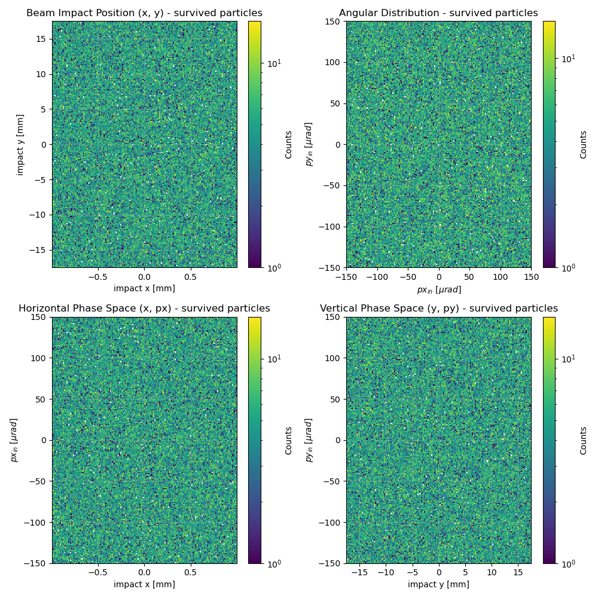

# General info from simulation

1. [Available features](#available-features-of-the-particles)
2. [SHORT CRYSTAL RUNS (50x200x2 mm3)](#short-crystal-1)
    - [run 25 aug](#specifics-for-cry1_20260825_16npz)
    - [run 26 aug](#specifics-for-cry1_20260826_15npz)
    - [run 26 aug](#specifics-for-cry1_20260826_16npz-and-cry1_20260826_18npz)
2. [SHORT CRYSTAL RUNS (2x35x4 mm3)](#short-crystal-2)
    - [run 1 - 01 sep](#specifics-for-cry1_20260901_17npz)

$\to$ [run_simulation.py](run_simulation.py)
| parameter | value |
| --- | --- |
| pdg_id (particle type) | `2212` (proton) |


## Available features of the particles

$\to$ full documentation here:  
[https://xsuite.readthedocs.io/en/latest/particlesmanip.html](https://xsuite.readthedocs.io/en/latest/particlesmanip.html)

or to see them directly:
```python
import xtrack as xt

particles_test = xt.Particles(mass0=xt.PROTON_MASS_EV, q0=1, energy0=180e9,
                                x=[0], px=[0], y=[0], py=[0],
                                zeta=[0], delta=[0])

# lista tutti gli attributi pubblici disponibili
print([a for a in dir(particles_test) if not a.startswith('_')])

# oppure, se disponibile, per una panoramica più leggibile 
# (tabella coordinate/reference)
particles1.show()   
```

`['XoStruct', 'add_particles', 'add_to_energy', 'anomalous_magnetic_moment', 'at_element', 'at_turn', 'ax', 'ay', 'beta0', 'charge', 'charge_ratio', 'chi', 'compile_kernels', 'copy', 'delta', 'energy', 'energy0', 'extra_sources', 'filter', 'from_dict', 'from_pandas', 'gamma0', 'get_active_particle_id_range', 'get_classical_particle_radius0', 'get_table', 'hide_first_n_particles', 'hide_lost_particles', 'init_independent_per_part_vars', 'init_pipeline', 'kin_ps', 'kin_px', 'kin_py', 'kin_xp', 'kin_xprime', 'kin_yp', 'kin_yprime', 'kinetic_energy0', 'lost_particles_are_hidden', 'mass', 'mass0', 'mass_ratio', 'merge', 'move', 'p0c', 'parent_particle_id', 'part_energy_varnames', 'part_energy_vars', 'particle_id', 'pdg_id', 'per_particle_vars', 'ptau', 'px', 'py', 'pzeta', 'q0', 'reference_from_pdg_id', 'remove_unused_space', 'reorganize', 'rigidity0', 'rpp', 'rvv', 's', 'scalar_vars', 'set_particle', 'show', 'size_vars', 'sort', 'spin_x', 'spin_y', 'spin_z', 'start_tracking_at_element', 'state', 't_sim', 'to_dict', 'to_json', 'to_pandas', 'to_table', 'unhide_first_n_particles', 'unhide_lost_particles', 'update_beta0', 'update_delta', 'update_gamma0', 'update_p0c', 'update_p0c_and_energy_deviations', 'update_ptau', 'weight', 'x', 'xoinitialize', 'y', 'zeta']`

attribute|what is it?|useful?
--|--|--
`zeta`, `delta` | relative longitudinal position, relative moment deviation | to see correlations energy-channeling
`ptau`, `pzeta`	| normalized energy momentum | redundant with delta for your purpose
`s` |	absolute longitudinal position along the line | not very useful here — you only have a drift + crystal
`at_element` |	index of the element where the particle is located/stops | tells you where a particle was lost with `state != 1`
`at_turn` |	number of turn | irrelevant for me - i don't do multi turns
`weight` |	statistical weight of the macroparticle |  doesn't matter if you don't use weighed macroparticles
`charge`, `mass`, `pdg_id`	| properties of the particle (charge, mass, type)	| static, the same for all (protons) - there's no need to save them for each particle - they're already in the metadata
`spin_x`, `spin_y`, `spin_z` |	 spin components | irrelevant except for polarization studies
`ax`, `ay` |	range of motion (action angle)	| useful only for emission/optical analysis, not for direct channeling

instead data like `beta0`, `gamma0`, `energy0`, `maa0`, `q0`, `p0c`. `kinetic_energy0`, `rigidity0` are properties of the reference particle and so always the same 

## short crystal 1

| parameter | value |
| --- | --- |
| material | "G4_Si" |
| $x$  | 50 mm |
| $y$  | 200 mm |
| material thickness  | 2 mm |
| $l$ (box around crystal) - keep same as thickness | 2 mm |
| horizontal width (box around crystal) - keep large  | 100 mm |
| bending angle | 50 urad |
| aperture of box around crystal  | rectangular |
| aper1  | 10e1 m |
| x emittance | 2.5e-6 |
| y emittance | 1e-6 |
| zeta coordinate | `zeros(npart)` |
| capacity | `int(npart * 2)` |

### specifics for `cry1_20260826_15.npz`
| parameter | value |
| --- | --- |
| number of particles | 200k|
| x position | `np.zeros(npart)` |
| y position | `np.zeros(npart)` |
| theta_in x divergence | `linspace(-150e-6, 150e-6, npart)`|
| theta_in y divergence | `zeros(npart)` |


### specifics for `cry1_20260826_18.npz`
| parameter | value |
| --- | --- |
| number of particles | 200k |
| x position | `np.random.uniform(-x_half_range, x_half_range, npart)` |
| y position | `np.random.uniform(-y_half_range, y_half_range, npart)` |
| theta_in x divergence | `linspace(-150e-6, 150e-6, npart)`|
| theta_in y divergence | `zeros(npart)` |


The great peak in $\Delta\theta=0$ is probably given by all of that particles that survived the aperture but did not pass through the crystal (we were not selecting what entered in the crystal and what did not): the `aper` value was 100 meters $\to$ definitely too big!  
Variables `aper1` and `aper2` were changed to 50 mm.  
!!! $\to$ actually 50 mm were giving me problems: too little particles surviving, so it was changed back to 100

## short crystal 2
**= same dimensions as TCCS =**
| parameter | value |
| --- | --- |
| material | "G4_Si" |
| $x$  | 2 mm |
| $y$  | 35 mm |
| material thickness  | 4 mm |
| $l$ (box around crystal) - keep same as thickness | 4 mm |
| horizontal width (box around crystal) - keep large  | 100 mm |
| bending angle | 50 urad |
| aperture of box around crystal  | rectangular |
| aper1  | 50 mm |
| aper2  | 50 mm |
| x emittance | 2.5e-6 |
| y emittance | 1e-6 |
| zeta coordinate | `zeros(npart)` |
| capacity | `int(npart * 2)` |

### specifics for `cry1_20260908_13.npz`
| parameter | value |
| --- | --- |
| number of particles | 200k |
| x position | `np.random.uniform(-x_half_range, x_half_range, npart)` |
| y position | `np.random.uniform(-y_half_range, y_half_range, npart)` |
| theta_in x divergence | `np.random.uniform(-150e-6, 150e-6, npart)`|
| theta_in y divergence | `np.random.uniform(-150e-6, 150e-6, npart)` |



### specifics for `cry1_20260914_18.npz` and `cry1_20260916_11.npz`

Now instead we are trying to reproduce the gaussian feature of the beam. From real data (8430 run) i fitted the impact positions $(x,y)$ and the entrance angles $(\theta_x,\theta_y)$.

|*Results (8430 run):* ||$\mu$|$\sigma$|
|--|--|--|--|
|after spatial cut | $\theta_x$ | -2.21 $\pm$ 0.01 | 21.83 $\pm$ 0.01|
|            | $\theta_y$ | 8.09 $\pm$ 0.02 | 37.87 $\pm$ 0.02|
|all         | $\theta_x$ | -0.93 $\pm$ 0.01 | 26.92 $\pm$ 0.01|
|            | $\theta_y$ | 6.79 $\pm$ 0.01 | 40.22 $\pm$ 0.02|
|after spatial cut | $x$ | -0.26 $\pm$ 0.01 | 2.34 $\pm$ 0.01|
|            | $y$ | 0.65 $\pm$ 0.00 | 2.33 $\pm$ 0.00|
|all         | $x$ | -0.12 $\pm$ 0.00 | 2.20 $\pm$ 0.00|
|            | $y$ | 0.64 $\pm$ 0.00 | 2.34 $\pm$ 0.00|

| parameter | value |
| --- | --- |
| number of particles | 200k |
|samples | `rng.multivariate_normal(mean=mu_avg, cov=cov_avg, size=npart)`|
| x position | `x_impact = samples[:, 0]` |
| y position | `y_impact = samples[:, 1]` |
| theta_in x divergence | `py_impact = samples[:, 2]`|
| theta_in y divergence | `py_impact = samples[:, 3]` |

### back to `aper1=100`: `cry1_20260917_16.npz` 


