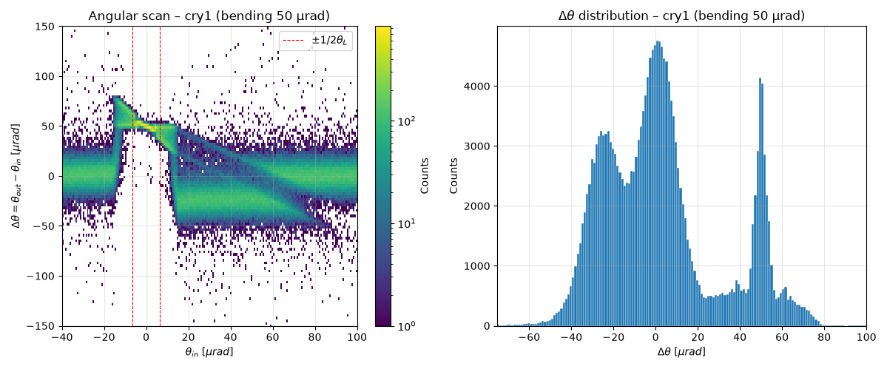
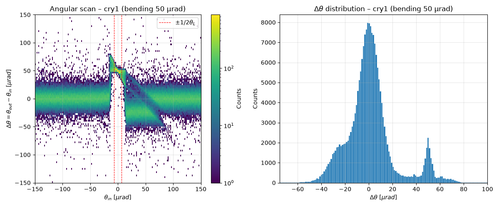
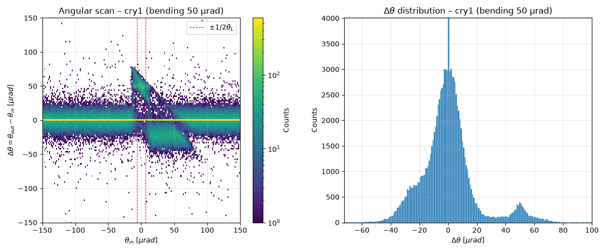

# General info from simulation

1. [SHORT CRYSTAL RUNS](#short-crystal)
    - [run 1 - 25 aug](#specifics-for-cry1_20260825_16npz)
    - [run 2 - 26 aug](#specifics-for-cry1_20260826_15npz)
    - [run 3 - 26 aug](#specifics-for-cry1_20260826_16npz)

[run_simulation.py](run_simulation.py)
| parameter | value |
| --- | --- |
| pdg_id (particle type) | `2212` (proton) |

## short crystal

| parameter | value |
| --- | --- |
| material | "G4_Si" |
| xsize  | 5 mm |
| ysize  | 20 mm |
| material thickness  | 2 mm |
| l (box around crystal) - keep same as thickness | 1 mm |
| horizontal width (box around crystal) - keep large  | 10 mm |
| bending angle | 50 urad |
| aperture of box around crystal  | rectangular |
| aper1  | 10e1 m |
| x emittance | 2.5e-6 |
| y emittance | 1e-6 |
| zeta coordinate | `zeros(npart)` |
| capacity | `int(npart * 2)` |

### specifics for `cry1_20260825_16.npz`
| parameter | value |
| --- | --- |
| number of particles | 200k |
| x position | `np.zeros(npart)` |
| y position | `np.zeros(npart)` |
| theta_in x divergence | `linspace(-40e-6, 100e-6, npart)`|
| theta_in y divergence | `zeros(npart)` |

### specifics for `cry1_20260826_15.npz`
| parameter | value |
| --- | --- |
| number of particles | 200k|
| x position | `np.zeros(npart)` |
| y position | `np.zeros(npart)` |
| theta_in x divergence | `linspace(-150e-6, 150e-6, npart)`|
| theta_in y divergence | `zeros(npart)` |

### specifics for `cry1_20260826_16.npz`
| parameter | value |
| --- | --- |
| number of particles | 200k |
| x position | `np.random.uniform(-x_half_range, x_half_range, npart)` |
| y position | `np.random.uniform(-y_half_range, y_half_range, npart)` |
| theta_in x divergence | `linspace(-150e-6, 150e-6, npart)`|
| theta_in y divergence | `zeros(npart)` |

### specifics for `cry1_20260826_18.npz`
| parameter | value |
| --- | --- |
| number of particles | 200k |
| x position | `np.random.uniform(-x_half_range, x_half_range, npart)` |
| y position | `np.random.uniform(-y_half_range, y_half_range, npart)` |
| theta_in x divergence | `np.random.uniform(-150e-6, 150e-6, npart)`|
| theta_in y divergence | `zeros(npart)` |